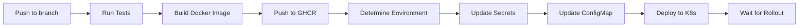

# UI Deployment - Dev/Prod Environments

## Overview

The UI chatbot is deployed to Kubernetes with separate dev and prod environments using the **same bot account**. Only one environment runs at a time - you switch between them by deploying to different namespaces.

## Account Strategy

You need:
- **1 Twitch streaming account** (your main channel)
- **1 Twitch bot account** (separate account for the bot)

Both dev and prod use the **same bot credentials** - you just deploy to different namespaces and test in the backend.

## Environment Strategy

### Namespaces
- **Production**: `eightbitsaxlounge-prod` (triggered by `main` branch)
- **Development**: `eightbitsaxlounge-dev` (triggered by `dev` branch)

### Usage Pattern

**Normal operation**: Production bot runs in `eightbitsaxlounge-prod`

**Testing new features**:
1. Scale prod to 0: `kubectl scale deployment ui-deployment --replicas=0 -n eightbitsaxlounge-prod`
2. Deploy dev version: Push to `dev` branch
3. Test in Twitch chat
4. Scale dev to 0: `kubectl scale deployment ui-deployment --replicas=0 -n eightbitsaxlounge-dev`
5. Scale prod back to 1: `kubectl scale deployment ui-deployment --replicas=1 -n eightbitsaxlounge-prod`

**Alternative**: Just deploy to one namespace at a time and ignore the other.

| Environment | Namespace | When Active | Branch |
|-------------|-----------|-------------|--------|
| Production | `eightbitsaxlounge-prod` | Normal operation | `main` |
| Development | `eightbitsaxlounge-dev` | Testing new features | `dev` |

## Deployment Workflow

### Automatic Deployment

The GitHub Actions workflow automatically deploys when:

1. **Production**: Push to `main` branch or change `ui/version.txt`
   - Builds image: `ghcr.io/owner/eightbitsaxlounge-ui:VERSION`
   - Deploys to: `eightbitsaxlounge-prod` namespace
   - Bot name: `EightBitSaxBot`

2. **Development**: Push to `dev` branch
   - Builds same image with same tag
   - Deploys to: `eightbitsaxlounge-dev` namespace  
   - Bot name: `EightBitSaxBot-Dev`

### Manual Deployment

Trigger deployment manually from GitHub Actions:
1. Go to **Actions** → **UI Release**
2. Click **Run workflow**
3. Select branch (`main` for prod, `dev` for dev)

## Workflow Steps



### What the Workflow Does

1. **Test**: Runs pytest with coverage
2. **Build**: Creates Docker image with version from `version.txt`
3. **Push**: Pushes to GitHub Container Registry
4. **Deploy**:
   - Creates/updates namespace
   - Creates secrets (same Twitch bot credentials for both environments)
   - Creates configmap (channel, MIDI URL for that environment)
   - Deploys pod with correct image
   - Waits for rollout to complete
   - Shows logs for verification

**Note**: Same bot account is used for both dev and prod. Only run one at a time.

## Required GitHub Secrets

Set these in **Settings → Secrets → Actions**:

| Secret Name | Description | Example |
|-------------|-------------|---------|
| `TWITCH_CLIENT_ID` | Your app's Client ID | `abc123xyz` |
| `TWITCH_BOT_USERNAME` | Bot account username | `yourbotname` |
| `TWITCH_CHANNEL` | Your Twitch channel name | `yourchannelname` |
| `MIDI_CLIENT_ID` | MIDI API client ID | `localhost` |
| `MIDI_CLIENT_SECRET` | MIDI API secret | `secret123` |

**Note**: Same credentials used for both dev and prod.

## Local Development

### Quick Start

```bash
cd ui

# Install dependencies
make install-dev

# Run locally (connects to Twitch immediately)
make dev

# Or run in Docker
make docker-build
make docker-run
```

### Testing Changes

1. **Make code changes**
2. **Test locally**: `make dev`
3. **Commit to dev branch**: Triggers deployment to dev namespace
4. **Test in Twitch chat** with dev bot
5. **Merge to main**: Triggers production deployment

## Switching Between Dev and Prod

### Enable Dev (Disable Prod)

```bash
# Scale prod down
kubectl scale deployment ui-deployment --replicas=0 -n eightbitsaxlounge-prod

# Deploy dev version (if not already)
git checkout dev
git push  # Triggers dev deployment

# Or scale up existing dev
kubectl scale deployment ui-deployment --replicas=1 -n eightbitsaxlounge-dev
```

### Enable Prod (Disable Dev)

```bash
# Scale dev down
kubectl scale deployment ui-deployment --replicas=0 -n eightbitsaxlounge-dev

# Scale prod up
kubectl scale deployment ui-deployment --replicas=1 -n eightbitsaxlounge-prod
```

### Check Which is Running

```bash
# Check both namespaces
kubectl get pods -n eightbitsaxlounge-prod -l app=ui
kubectl get pods -n eightbitsaxlounge-dev -l app=ui

# Only one should show a running pod
```

### Viewing Logs

```bash
# Production logs
kubectl logs -n eightbitsaxlounge-prod -l app=ui --tail=50 -f

# Development logs
kubectl logs -n eightbitsaxlounge-dev -l app=ui --tail=50 -f
```

### Checking Status

```bash
# Production
kubectl get pods -n eightbitsaxlounge-prod
kubectl describe deployment ui-deployment -n eightbitsaxlounge-prod

# Development
kubectl get pods -n eightbitsaxlounge-dev
kubectl describe deployment ui-deployment -n eightbitsaxlounge-dev
```

### Restarting Bots

```bash
# Restart production bot
kubectl rollout restart deployment/ui-deployment -n eightbitsaxlounge-prod

# Restart dev bot
kubectl rollout restart deployment/ui-deployment -n eightbitsaxlounge-dev
```

### Scaling (if needed)

```bash
# Scale dev to 0 to disable
kubectl scale deployment ui-deployment --replicas=0 -n eightbitsaxlounge-dev

# Re-enable
kubectl scale deployment ui-deployment --replicas=1 -n eightbitsaxlounge-dev
```

## Version Management

Update the version in `ui/version.txt`:

```bash
# Current version
cat ui/version.txt

# Update version (triggers deployment when pushed)
echo "1.1.0" > ui/version.txt
git add ui/version.txt
git commit -m "Bump UI version to 1.1.0"
git push
```

## Troubleshooting

### Bot not connecting to Twitch

Check secrets are set:
```bash
kubectl get secret twitch-secrets -n eightbitsaxlounge-prod -o yaml
```

Verify token expiry:
```bash
# Check logs for expiry warnings
kubectl logs -n eightbitsaxlounge-prod -l app=ui | grep "expires"
```

### Wrong bot name in chat

Check configmap:
```bash
kubectl get configmap ui-config -n eightbitsaxlounge-prod -o yaml
```

Should show `bot_name: EightBitSaxBot` for prod or `bot_name: EightBitSaxBot-Dev` for dev.

### Both bots responding (Twitch shows duplicate responses)

**This means both dev and prod are running** - you should only run one at a time:

```bash
# Check which are running
kubectl get pods -n eightbitsaxlounge-prod -l app=ui
kubectl get pods -n eightbitsaxlounge-dev -l app=ui

# Scale down the one you don't want
kubectl scale deployment ui-deployment --replicas=0 -n eightbitsaxlounge-dev
```

### Deployment failed

Check workflow logs:
1. Go to **Actions** tab in GitHub
2. Click on failed workflow run
3. Expand failed step to see error

Common issues:
- Secrets not set in GitHub
- Kubernetes context not configured on runner
- Image pull errors (check GHCR permissions)

## Best Practices

1. **Always test in dev first**: Push to `dev` branch, verify functionality
2. **Monitor token expiry**: Watch logs for expiry warnings
3. **Use semantic versioning**: `major.minor.patch` in `version.txt`
4. **Check logs after deployment**: Verify bot connected successfully
5. **Keep dev bot enabled**: Helps catch issues before they hit production
6. **Use feature branches**: Create feature branch → merge to dev → test → merge to main

## Architecture

```
GitHub Push → GitHub Actions
    ↓
Build Docker Image → Push to GHCR
    ↓
Deploy to Kubernetes (one namespace at a time)
    ↓
┌─────────────────────┬─────────────────────┐
│  eightbitsaxlounge-prod │  eightbitsaxlounge-dev  │
│  (normal operation) │  (testing only)     │
│         OR          │         OR          │
│  EightBitSaxBot     │  EightBitSaxBot     │
│  (replicas: 1)      │  (replicas: 0)      │
└─────────────────────┴─────────────────────┘
         ↓
    Twitch IRC (same bot account)
         ↓
    #yourchannelname
         ↓
    MIDI Service (different per namespace)
```

Only one bot is active at a time, using the same Twitch account but connecting to different backend services.
